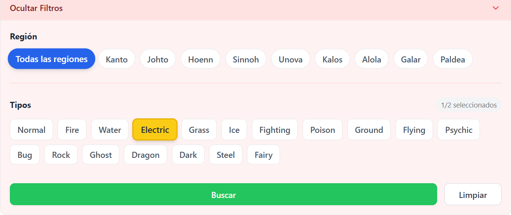

# 🔴 Modern Pokédex - React Client

Este repositorio contiene el **Frontend** de una aplicación moderna de Pokédex. Está construida con **React y TypeScript**, enfocada en el rendimiento, una interfaz de usuario limpia y una experiencia de usuario fluida mediante el uso de estados de carga (Skeletons) y filtros dinámicos.

> ⚠️ **Nota:** Este proyecto funciona en conjunto con una API Backend en .NET Core. Asegúrate de tener el backend corriendo localmente para obtener los datos.  ( Puedes Encontrar el Api en este mismo Perfil con el Nombre PokemonApiNet)

## 🚀 Características Principales

- **Búsqueda Inteligente:** Busca Pokémon por nombre o número de Pokédex.
- **Filtros Avanzados:**
  - **Por Tipos:** Selecciona hasta 2 tipos simultáneamente (ej. Fuego + Volador) con validación lógica.
  - **Por Región:** Filtrado instantáneo por generaciones (Kanto, Johto, Hoenn, etc.) usando rangos de ID.
- **UX Mejorada:** Implementación de **Skeleton Loaders** con Tailwind para evitar saltos de contenido (layout shifts) durante la carga de datos masivos.
- **Componentes Accesibles:** Uso de **Headless UI** para menús desplegables y transiciones suaves.
- **Diseño Responsivo:** Grid adaptable a móviles, tablets y escritorio.

## 🛠️ Tech Stack

* **Core:** React 18 + TypeScript
* **Estilos:** Tailwind CSS
* **Componentes UI:** Headless UI & Heroicons
* **Http Client:** Axios
* **Build Tool:** Vite (o CRA, según corresponda)

## 📸 Capturas de Pantalla

